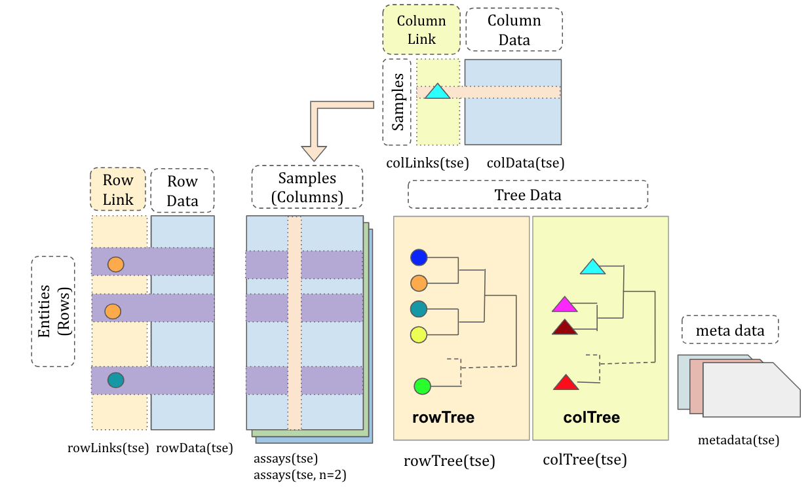

**R version**: `r R.version.string`

**Bioconductor version**: `r BiocManager::version()`

<!--  Update the name of the package below to be the name of the workflow package you are working on  
**Package**: `r packageVersion("base")` -->

```{r setup_knitr, include = FALSE}
library(BiocStyle)
library(knitr)
use.cache <- TRUE
# Use fig.width = 7 for html and fig.width = 6 for pdf
knitr::opts_chunk$set(cache.path = "cache/",
    warning = FALSE, message = FALSE, error = FALSE,
    fig.path = "figure/", fig.height = 3.5)
#options(width=75)
```

# Introduction

Biological data with a hierarchy appears in several fields. A notable example is in the microbial survey studies where the microbiome is profiled with amplicon sequencing or whole genome shotgun sequencing, and microbial taxa share a common evolutionary history that can be encoded as a tree. A hierarchical structure might also be seen in single cell cytometry and RNA-seq datasets where nodes of a tree represent cell sub-populations at different granularities. Currently, 
`phyloseq` and `SingleCellExperiment` [@R-SingleCellExperiment] are dominant classes in the microbial data and the single cell data analysis, respectively. The former is not a `SummarizedExperiment` class (`r Biocpkg("SummarizedExperiment")` [@R-SummarizedExperiment]) that is widely used in Bioconductor, and the latter doesn't provide functionalities on the hierarchical structure. As there are similarities in data structure shared in these fields, we are motivated to develop a S4 class, `TreeSummarizedExperment`, to store hierarchical biological data. It extends the `SingleCellExperiment` [@R-SingleCellExperiment] class to provide linkages between the `assays` data and the tree objects. Because `TreeSummarizedExperiment` is a member of `SummarizedExperiment` family, it could benefit from many tools in the Bioconductor ecosystem that are developed for this family (e.g., `r Biocpkg("iSEE")`). Given that all slots of the `phyloseq` class have their corresponding slots in `TreeSummarizedExperiment` class, it's quite convenient to do conversion in between.

The `TreeSummarizedExperiment` class is used to store the rectangular
data with the hierarchical structure, and establishs the link between the `assays` and the tree structure. Compared to the `SingleCellExperiment` [@R-SingleCellExperiment] class, `TreeSummarizedExperiment` has
four more slots.

* `rowTree`: the hierarchical structure on the rows of the `assays` tables.
* `rowLinks`: the link between rows of the `assays` tables and the `rowTree`.
* `colTree`: the hierarchical structure on the columns of the `assays` tables.
* `colLinks`: the link information between columns of `assays` tables and the
`colTree`.

```{r use-knitr, echo=FALSE, fig.cap= "The structure of the TreeSummarizedExperiment class.", out.width="100%"}

```

The `rowTree` and `colTree` could be empty (`NULL`) if no trees are available.
Correspondingly, the `rowLinks` and `colLinks` would be `NULL`. All the other
slots in `TreeSummarizedExperiment` are inherited from `SingleCellExperiment` [@R-SingleCellExperiment].

The slots `rowTree` and `colTree` only accept the tree data as the `phylo`
class. If a tree is available in other formats, one would need to convert it to `phylo` with other R packages (e.g., `r Biocpkg("treeio")` [@Wang2019]).

The `r Biocpkg("TreeSummarizedExperiment")` package provides functions that could be separated into two main types. Functions in the first type directly work on the `TreeSummarizedExperiment` class (e.g., constructors and accessors); and others work on the tree (`phylo`) class. The latter is used mainly to create customized functions on the `TreeSummarizedExperiment` class. Also, users are freely to use functions available in other R packages to manipulate the `phylo` class (e.g., `r CRANpkg("ape")` [@ape2019]).     


# Methods

## Implementation
```{r message=FALSE}
library(TreeSummarizedExperiment)
```

We generate a toy datset that has observations of 6 entities collected from 4
samples as an example to show how to construct the `TreeSummarizedExperment` object.
```{r}
# assays data
assay_data <- rbind(rep(0, 4), matrix(1:20, nrow = 5))
colnames(assay_data) <- paste(rep(LETTERS[1:2], each = 2), 
                            rep(1:2, 2), sep = "_")
rownames(assay_data) <- paste("entity", seq_len(6), sep = "")
assay_data
```

The information of entities and samples are given in the **row_data** and **col_data**, respectively.
```{r}
# row data
row_data <- data.frame(Kindom = rep("A", 6),
                     Phylum = c("B1", "B1", rep("B2", 4)),
                     Class = c("C1", "C1", "C2", "C2", "C3", "C3"),
                     OTU = c("D1", "D2", "D3", "D4", "D5", "D6"),
                     row.names = rownames(assay_data),
                     stringsAsFactors = FALSE)

row_data
# column data
col_data <- data.frame(gg = c(1, 2, 3, 3),
                    group = rep(LETTERS[1:2], each = 2), 
                    row.names = colnames(assay_data),
                     stringsAsFactors = FALSE)
col_data
```

The hierarchical structure of the `r nrow(assay_data)` entities and `r ncol(assay_data)` samples are denoted as
**row_tree** and **col_tree**, respectively. The two trees are `phylo` objects randomly created with `rtree` from the package `r CRANpkg("ape")`.

```{r}
library(ape)

# The first toy tree 
set.seed(12)
row_tree <- rtree(5)

# The second toy tree 
set.seed(12)
col_tree <- rtree(4)

# change node labels
col_tree$tip.label <- colnames(assay_data)
col_tree$node.label <- c("All", "GroupA", "GroupB")
```

We visualize the tree using the package `r Biocpkg("ggtree")` [@Yu2017]. The node labels and the node numbers are in blue and orange texts, respectively. Here, the
internal nodes of the **row_tree** have no labels.

```{r rtree, fig.cap="\\label{rtree} The structure of the row tree", message=FALSE, fig.height= 2.5}
library(ggtree)
library(ggplot2)

# Visualize the row tree
ggtree(row_tree, size = 2, branch.length = "none") +
geom_text2(aes(label = node), color = "darkblue",
                hjust = -0.5, vjust = 0.7, size = 4) +
geom_text2(aes(label = label), color = "darkorange",
            hjust = -0.1, vjust = -0.7, size = 4) +
  ylim(c(0.8, 5.5))
```

The **col_tree** has labels for internal nodes.
```{r ctree, fig.cap="\\label{ctree} The structure of the column tree", fig.height= 2.5}
# Visualize the column tree
ggtree(col_tree, size = 2, branch.length = "none") +
geom_text2(aes(label = node), color = "darkblue",
                hjust = -0.5, vjust = 0.7, size = 4) +
geom_text2(aes(label = label), color = "darkorange",
            hjust = -0.1, vjust = -0.7, size = 4)+
  ylim(c(0.8, 4.5)) +
  xlim(c(0, 2.2))
```

### The construction of `TreeSummarizedExperiment`

The `TreeSummarizedExperiment` class is used to store the toy data:
**assay_data**, **row_data**, **col_data**, **col_tree** and **row_tree**, To
correctly store data, the link information between the rows (or columns) of
**assay_data** and the nodes of the **row_tree** (or **col_tree**) is required
to provide via a character vector `rowNodeLab` (or `colNodeLab`). Those columns
or rows that mismatch with nodes of the tree are removed with
warnings. The link data between the `assays` tables and the tree data is
automatically generated in the construction.

The row and the column trees are allowed to be included simultaneously in the
construction. As the column names of the `assays` table and the node labels of the column tree are consistent, we omit the step of providing `colNodeLab`.

```{r}
# provide the node labels in rowNodeLab
tip_lab <- row_tree$tip.label
row_lab <- tip_lab[c(1, 1:5)]
all(colnames(assay_data) %in% c(col_tree$tip.label, col_tree$node.label))

both_tse <- TreeSummarizedExperiment(assays = list(assay_data),
                                rowData = row_data,
                                colData = col_data,
                                rowTree = row_tree,
                                rowNodeLab = row_lab,
                                colTree = col_tree)
```


```{r}
both_tse
```
When printing out **both_tse**, we see a similar message as
`SingleCellExperiment` [@R-SingleCellExperiment] with four additional lines about `rowLinks`, `rowTree`,
`colLinks` and `colTree`. 

### The accessor functions

For slots inherited from the family of `SummarizedExperiment` class, they could be accessed in the traditional way.
```{r eval=FALSE}
# access assays
assays(both_tse)

# the row data
rowData(both_tse)

# the column data
colData(both_tse)

# the metadata: it's empty here
metadata(both_tse)
```

For new slots, we provide `rowTree` (`colTree`) to access the row (column) trees, and `rowLinks` (`colLinks`) to access the link information between `assays` and nodes of the row (column) tree. If the tree is not available, the corresponding link data is `NULL`. 

```{r}
# access trees
rowTree(both_tse)
colTree(both_tse)
```

```{r}
# access the link data
(rLink <- rowLinks(both_tse))
(cLink <- colLinks(both_tse))
```

The link data has the `LinkDataFrame` class that is extended from the `DataFrame` class with the restriction that it has at least four columns:
**nodeLab**, **nodeLab\_alias**, **nodeNum**, and **isLeaf**. More details about
the `DataFrame` class could be found in the `r Biocpkg("S4Vectors")` package.

* nodeLab: the labels of nodes on the tree
* nodeLab\_alias: the alias labels of nodes on the tree
* nodeNum: the numbers of nodes on the tree
* isLeaf: whether the node is a leaf node


### The subseting function

Two ways are available to subset a `TreeSummarizedExperiment` object: `[` to
subset by rows or columns, and `subsetByNode` to subset by nodes of a tree. To
keep track of the original data, the `rowTree` and `colTree` stay the same after
subseting.

```{r}
sub_tse <- both_tse[1:2, 1]
sub_tse
```

`rowLinks` and `rowData` are updated accordingly.
```{r}
# The first four columns are from rowLinks data and the others from the rowData
cbind(rowLinks(sub_tse), rowData(sub_tse))
```

```{r}
# The first four columns are from colLinks data and the others from colData
cbind(colLinks(sub_tse), colData(sub_tse))
```

To subset by nodes, we specify the node by its node label or node number. Here, *entity1* and *entity2* are both mapped to the same node `t3`, so both of them are obtained.

```{r}
node_tse <- subsetByNode(x = both_tse, rowNode = "t3")

rowLinks(node_tse)
```

It is allowed to subset simultaneously in both dimensions.

```{r}
node_tse <- subsetByNode(x = both_tse, rowNode = "t3", 
                         colNode = c("A_1", "A_2"))
assays(node_tse)[[1]]
```

### Change the tree

The current tree is allowed to be replaced by a new one by using the `changeTree`. If the hierarchical information is available as a `data.frame` with each column representing a taxonomic level (e.g., *row_data*), we provide `toTree` to convert it into a `phylo` object. 

```{r, fig.height=2.5}
# The toy taxonomic table
taxa <- rowData(both_tse)

# convert it to a phylo tree
taxa_tree <- toTree(data = taxa)

# Viz the new tree
ggtree(taxa_tree)+
geom_text2(aes(label = node), color = "darkblue",
                hjust = -0.5, vjust = 0.7, size = 4) +
geom_text2(aes(label = label), color = "darkorange",
            hjust = -0.1, vjust = -0.7, size = 4) +
    geom_point2()
```

The information to match nodes of two trees are required if nodes are labeled differently. 
```{r}
taxa_tse <- changeTree(x = both_tse, rowTree = taxa_tree, 
                       rowNodeLab = taxa[["OTU"]])

taxa_tse
rowLinks(taxa_tse)
```


### Aggregation

Data can be flexibly aggregated to different levels of the tree.

#### The column dimension {#aggCol}

Here, we show the aggregation on the column dimension. The
`TreeSummarizedExperiment` object is assigned to the argument `x`. The desired
aggregation level is given in `colLevel`. The level could be specified via the
node label (the orange texts in Figure \@ref(fig:ctree)) or the node number (the
blue texts in Figure \@ref(fig:ctree)). We could further decide how to aggregate
via the argument `FUN`.

```{r}
# use node labels to specify colLevel
aggCol <- aggValue(x = taxa_tse, 
                   colLevel = c("GroupA", "GroupB"),
                   FUN = sum)
# or use node numbers to specify colLevel
aggCol <- aggValue(x = taxa_tse, colLevel = c(6, 7), FUN = sum)
```


```{r}
assays(aggCol)[[1]]
```

The `rowData` does not change, but the `colData` adjusts with the change of the
`assays` table. For example, the column **group** has the `A` value for
`GroupA` because the descendant nodes of `GroupA` all have the value `A`; the
column **gg** has the `NA` value for `GroupA` because the descendant nodes of
`GroupA` have different values, (1 and 2).
```{r}
# before aggregation
colData(taxa_tse)
# after aggregation
colData(aggCol)
```

The `colLinks` is updated to link the new rows of `assays` tables and the column
tree.
```{r}
# the link data is updated
colLinks(aggCol)
```
From the Figure \@ref(fig:rtree), we could see that the nodes 6 and 7 are
labeled with `GroupA` and `GroupB`, respectively. This agrees with the
column link data.

#### The row dimension {#aggRow}

Similarly, we could aggregate the data to the phylum level by providing the internal nodes that represent the phylum level, `taxa_one`.

```{r}
# the phylum level
taxa <- c(taxa_tree$tip.label, taxa_tree$node.label)
(taxa_one <- taxa[startsWith(taxa, "Phylum:")])

# aggregation
agg_taxa <- aggValue(x = taxa_tse, rowLevel = taxa_one, FUN = sum)
agg_taxa
```

It's free to choose nodes from different taxonomic ranks.

```{r}
# A mixed level
taxa_mix <- c("Class:C3", "Phylum:B1")
agg_any <- aggValue(x = taxa_tse, rowLevel = taxa_mix, FUN = sum)
rowData(agg_any)
```


#### Both dimensions

The aggregation on both dimensions could be performed in one step using the same
function specified via `FUN`. If different functions are required for different
dimensions, the aggregation should be performed in two steps because the aggregation order matters.

```{r}
agg_both <- aggValue(x = both_tse, colLevel = c(6, 7), 
                    rowLevel = 7:9, FUN = sum)
```

As expected, we obtain a table with 3 rows (`rowLevel = 7:9`) and 2 columns
(`colLevel = c(6, 7)`). 

```{r}
assays(agg_both)[[1]]
```

### Functions working on the `phylo` object.

We create some functions to manipulate or to extract information
from the `phylo` object. More functions could be found in other packages, such
as `r CRANpkg("ape")` [@ape2018], `r CRANpkg("tidytree")`. These functions are
useful when users want to customize functions for the `TreeSummarizedExperiment`
class.

To show these functions, we use an example tree that has its node labels (black texts) and node numbers (blue texts) shown as below. 
```{r, fig.height= 2.5}
ggtree(tinyTree, branch.length = "none") +
    geom_text2(aes(label = label), hjust = -0.1, size = 3) +
    geom_text2(aes(label = node), vjust = -0.8,
               hjust = -0.2, color = 'blue', size = 3) 
```

#### print out nodes of the tree

We could print out all nodes (`type = "all"`), the leaves (`type = "leaf"`) or the internal nodes (`type = "internal"`) with `printNode`.

```{r}
printNode(tree = tinyTree, type = "all")
```

#### Count the number of nodes

```{r}
# The number of leaves
countLeaf(tree = tinyTree)

# The number of nodes (leaf nodes and internal nodes)
countNode(tree = tinyTree)
```

#### Conversion of the node label and the node number

The translation between the labels and the numbers of nodes could be achieved by
the function `transNode`. 
```{r}
transNode(tree = tinyTree, node = c(12, 1, 4))
```

```{r}
transNode(tree = tinyTree, node = c("t4", "Node_18"))
```

#### Find the descendants 

To get descendants that are at the leaf level, we could set the argument
`only.leaf = TRUE`.
```{r}
# only the leaf nodes
findOS(tree = tinyTree, node = 17, only.leaf = TRUE)
```

The argument `only.leaf = FALSE` is set to get all descendants 
```{r}
# all descendant nodes
findOS(tree = tinyTree, node = 17, only.leaf = FALSE)
```

#### Find the sibling node

The input `node` could be either the node label or the node number. 
```{r}
# node = 5, node = "t4" are the same node
findSibling(tree = tinyTree, node = 5)
findSibling(tree = tinyTree, node = "t4")
```

#### Find the share node

This would find the first node that joined by the specified nodes (`node`) in
their paths to the root.
```{r}
shareNode(tree = tinyTree, node = c(5, 6))
```


#### Identify leaf nodes
```{r}
isLeaf(tree = tinyTree, node = 5)
isLeaf(tree = tinyTree, node = 17)
```

#### The distance between two nodes

The distance between two nodes is obtained using `distNode`.
```{r}
distNode(tree = tinyTree, node = c(1, 5))
```


#### Convert a `phylo` object to a matrix

Each row gives a path that connects a leaf and the root. Each entry value is a node reprsented by its node number.
```{r}
matTree(tree = tinyTree)
```

### Customize functions for the `TreeSummarizedExperiment` class {#modifyLink}

We show examples about how to create functions for the
`TreeSummarizedExperiment`. Here, the function `rmRows` is to remove
entities (on rows) that have zero in all samples (on columns) in the first
`assays` table.

```{r}
# dat: a TreeSummarizedExperiment
rmRows <- function(dat) {
    # calculate the total counts of each row
    count <- assays(dat)[[1]]
    tot <- apply(count, 1, sum)
    
    # find the row with zero in all columns
    ind <- which(tot == 0)
    
    # remove those rows
    out <- dat[-ind, ]
    return(out)
    
}
(rte <- rmRows(dat = both_tse))
rowLinks(rte)
```

The function `rmRows` doesn't update the tree. Leaves that are mapped to the removed rows could be dropped with `ape::drop.tip`.

```{r}
updateRowTree <- function(tse, dropLeaf) {
    ## -------------- new tree: drop leaves ----------
    oldTree <- rowTree(tse)
    newTree <- ape::drop.tip(phy = oldTree, tip = dropLeaf)
    
    ## -------------- update the row link ----------
    # track the tree
    track <- trackNode(oldTree)
    track <- ape::drop.tip(phy = track, tip = dropLeaf)
    
    # row links
    rowL <- rowLinks(tse)
    rowL <- DataFrame(rowL)
    
    # update the row links: 
    #   1. use the alias label to track and updates the nodeNum
    #   2. the nodeLab should be updated based on the new tree using the new
    #      nodeNum
    #   3. lastly, update the nodeLab_alias
    rowL$nodeNum <- transNode(tree = track, node = rowL$nodeLab_alias,
                              message = FALSE)
    rowL$nodeLab <- transNode(tree = newTree, node = rowL$nodeNum, 
                              use.alias = FALSE, message = FALSE)
    rowL$nodeLab_alias <- transNode(tree = newTree, node = rowL$nodeNum, 
                                    use.alias = TRUE, message = FALSE)
    rowL$isLeaf <- isLeaf(tree = newTree, node = rowL$nodeNum)

    rowNL <- new("LinkDataFrame", rowL)
    
    ## update the row tree and links
    newDat <- BiocGenerics:::replaceSlots(tse,
                                          rowLinks = rowNL,
                                          rowTree = list(phylo = newTree))
    return(newDat)
    
}


```

Now the row tree has four leaves.
```{r}
# find the mismatch between the rows of the 'assays' table and the leaves of the
# tree
row_tree <- rowTree(rte)
row_link <- rowLinks(rte)
leaf_tree <- showNode(tree = row_tree, only.leaf = TRUE)
leaf_data <- row_link$nodeNum[row_link$isLeaf]
leaf_rm <- setdiff(leaf_tree, leaf_data)
ntse <- updateRowTree(tse = rte, dropLeaf = leaf_rm)
```

```{r}
ntse
rowLinks(ntse)
```

## Operation
The `TreeSummarizedExperiment` package can be installed by following the standard installation procedures of Bioconductor package. 

```{r eval=FALSE}
# install BiocManager
install.packages("BiocManager")

# install TreeSummarizedExperiment package
BiocManager::install("TreeSummarizedExperiment")
```

Minimum system requirements is to have R with version (3.6 or later) on a Mac, Windows or Linux system.


# Use Cases <!-- Optional - only if NO new datasets are included -->

To demonstrate the functionality of `TreeSummarizedExperiment`, we use it to store and manipulate a real microbial dataset. We further show exploratory graphics using available functions that are designed for the `SummarizedExperiment` class in other packages (e.g., `r Biocpkg("scrater")`), or customized functions that are generated together with visualization packages (e.g., `r CRANpkg("ggplot2")` [@R-ggplot2]).

```{r}
suppressPackageStartupMessages({
  # Packages provide dataset
  library(HMP16SData)
  
  # Packages to manipulate data extracted from TreeSummarizedExperiment
  library(tidyr)
  library(dplyr)
  
  # Packages provide visualization
  library(ggplot2)
  library(TreeHeatmap)
  library(scales)
  library(ggtree)
  library(scater)
  library(cowplot)
  })
```

The Human Microbiome Project (HMP) 16S rRNA sequencing data is downloaded from the R package `r Biocpkg("HMP16SData")`. It is collected from the variable regions 3–5 and is provided as a SummarizedExperiment object via the `ExperimentHub`.

```{r}
v35 <- V35()
v35
```

## The storage of HMP 16S rRNA-seq data

We store the phylogenetic tree as the `rowTree`. Links between nodes of the tree
and rows of `assays` are automatically generated in the construction of the
`TreeSummarizedExperiment` object, and are stored as `rowLinks`. Rows of
`assays` tables that mismatch with nodes of the tree are removed.

```{r}
tse_phy <- TreeSummarizedExperiment(assays = assays(v35),
                                rowData = rowData(v35),
                                colData = colData(v35),
                                rowTree = metadata(v35)$phylogeneticTree,
                                metadata = metadata(v35)["experimentData"])
tse_phy

cD <- colData(tse_phy)
dim(table(cD$HMP_BODY_SITE, cD$RUN_CENTER))
```


## Replace the phylogenetic tree with the taxonomic tree

Here, we replace the phylogenetic with the taxonomic tree that is generated from the taxonomic table. Due to the existence of polyphyletic groups, a tree structure can't be really generated. For example, the `Ruminococcus` genus is from different families: `Lachnospiraceae` and `Ruminococcaceae`.  

```{r}
# taxonomic tree
tax_0 <- rowData(tse_phy)[, -1] %>%
  data.frame() %>%
  mutate(OTU = rownames(tse_phy))
tax_loop <- detectLoop(tax_tab = tax_0)

# show loops that are not caused by NA
no_na <- tax_loop$child != "NA" & tax_loop$parent != "NA"
tax_loop[no_na, ]
```

To resolve the loops, we add suffix to the polyphyletic genus with `resolveLoop`. For example, `Ruminococcus` belonging to the `Lachnospiraceae` and the `Ruminococcaceae` families become `Ruminococcus_1` and `Ruminococcus_2`, respectively. A `phylo` tree is created afterwards using `toTree`.

```{r}
tax_1 <- resolveLoop(tax_tab = tax_0)
tax_tree <- toTree(data = tax_1)
tax_tree
```

Here, `changeTree` is used to replace the phylogenetic tree with the taxonomic
tree and the link data is updated accordingly.

```{r}
tse_tax <- changeTree(x = tse_phy, rowTree = tax_tree)
```


## Compare samples across centers

Here, we extract the sample information from the `colData`, and calculate the sequencing depths and the number of non-zero OTUs for samples using the data in `assays` table.
```{r fig.fullwidth = TRUE}
count <- assays(tse_phy)[[1]]

df_OTU <- colData(tse_phy) %>%
  data.frame() %>%
  mutate(nOTU = colSums(count > 0),
         Total_count = colSums(count))
```

To make pretty figures from `r CRANpkg("ggplot2")`, we customized a theme to be applied to several plots in this section.
```{r}
# Customized the plot theme
prettify <- theme_bw(base_size = 10) + theme(
    panel.spacing = unit(0, "lines"),
    axis.text = element_text(color = "black"),
    axis.text.x = element_text(angle = 45, hjust = 1),
    legend.key.size= unit(6, "mm"),
    legend.spacing.x = unit(1, "mm"),
    plot.title = element_text(hjust = 0.5),
    legend.text = element_text(size = 9),
    legend.position="bottom",
    strip.background = element_rect(colour = "black", fill = "gray90"),
    strip.text.x = element_text(color = "black", size = 10),
    strip.text.y = element_text(color = "black", size = 10))
```

The number of OTUs are quite different in samples from different body sites.
```{r}
ggplot(df_OTU) +
  geom_boxplot(aes(x = RUN_CENTER, y = nOTU,
                   block = HMP_BODY_SITE, fill = HMP_BODY_SITE))+ 
  scale_y_sqrt(breaks = c(50, 200, 500, 1000, 2000, 3000, 5000)) +
  labs(title = "The number of OTUs in sample") +
  scale_fill_brewer(palette = "Set1") +
  prettify 
```

The sequencing depth of samples across different coordination centers are quite
similar. Within the coordination center, samples collected from `Skin` are more spread out in the sequencing depth than those from other body sites.

```{r}
ggplot(df_OTU) +
  geom_boxplot(aes(x = RUN_CENTER, y = Total_count,
                   block = HMP_BODY_SITE, fill = HMP_BODY_SITE)) + 
  scale_y_continuous(trans = log2_trans()) +
  labs(title = "The sequencing depths of samples") +
  scale_fill_brewer(palette = "Set1") +
  prettify 
```
More samples are taken from the `oral` site than other body sites
```{r}
ggplot(df_OTU) +
  geom_bar(aes(RUN_CENTER, fill = HMP_BODY_SITE),
           position = position_dodge()) +
  labs(title = "The number of samples across centers") +
  scale_fill_brewer(palette = "Set1") +
  prettify 
```


## The relative abundance of phyla in samples

The relative abundance of OTUs within sample are calculated and stored in the `assays` with the name `rel_abund`. 

```{r}
# add relative abundance in the second assays
abd <- assays(tse_tax)[[1]]
assays(tse_tax)[["rel_abund"]] <- apply(abd, 2, FUN = function(x){
  x/sum(x)
})

```

We aggregate the relative abundance to the phylum level using `aggValue`. It calculate the relative abundance of a phylum as the sum of the relative abundance of OTUs belonging to it.
```{r}
# aggregation to the phylum level
lab <- c(rowTree(tse_tax)$node.label, rowTree(tse_tax)$tip.label)
lab_phylum <- lab[startsWith(lab, "PHYLUM")]
agg_phylum <- aggValue(x = tse_tax, 
                  rowLevel = lab_phylum,
                  assay = "rel_abund",
                  message = FALSE)
```

To compare the relative abundance of phyla across body sites, we average them over samples from the same body site, and show those with relative abundance above $0.01$ in the scale $[0, 1]$. 
```{r}
aC <- assays(agg_phylum)$rel_abund
rD <- rowData(agg_phylum) 
cD <- colData(agg_phylum) 
rL <- rowLinks(agg_phylum)
df_abd <- t(aC) %>%
  data.frame() %>% 
  mutate(body_site = cD$HMP_BODY_SITE,
         sample_id = colnames(aC)) %>%
  gather(key = "node", value = "rel_abund", 
         -c(body_site, sample_id)) %>%
  group_by(body_site, node) %>%
  summarize(relative_abundance = mean(rel_abund)) %>%
  mutate(Phylum = rD$PHYLUM)

# The phylum level
ggplot(df_abd) +
  geom_bar(data = . %>% filter(relative_abundance >= 0.01),
           aes(x= body_site, y = relative_abundance, fill = Phylum),
           stat = "identity") +
  scale_fill_brewer(palette = "Set1") +
  prettify


```


## Dimensionality reduction

We visualize samples in reduced dimensions to see whether those from the same body site are more similar. Three dimensionality reduction techniques, including principal component analysis (PCA), t-distributed Stochastic Neighbor Embedding (t-SNE), uniform manifold approximation and projection (UMAP) are used. As `TreeSummarizedExperiment` is inherited from `SingleCellExperiment`, we could directly use functions from the package `r Biocpkg("scater")`. We first apply techniques using data at the OTU level, then we further try t-SNE using data at different taxonomic levels, e.g., the genus and the phylum levels, to see whether the resolution affects the separation of samples. 


### PCA

The PCA is performed on the log-transformed counts that are stored in the `assays` table with the name `logcounts`. We see that the `Oral` samples are distinct from those of other body sites. Samples from `Skin`, `Urogenital Tract`, `Airways` and `Gastrointestinal Tract` are not separated very well in the top two principle components of PCA.

```{r}

# log-transformed data
assays(tse_tax)$logcounts <- log(assays(tse_tax)[[1]] + 1)

# run PCA at the OTU level
tse_tax <- runPCA(tse_tax, name="PCA_OTU", exprs_values = "logcounts")

# plot samples in the reduced dimensions
plotReducedDim(tse_tax, dimred = "PCA_OTU", 
               colour_by = "HMP_BODY_SITE")+
  labs(title = "PCA at the OTU level") +
  guides(fill = guide_legend(override.aes = list(size=2.5, alpha = 1))) +
  theme(plot.title = element_text(hjust = 0.5),
        legend.position = "bottom")
```

### t-SNE

The separation is well improved with the use of `t-SNE`. Samples from `Oral`, `Gastrointestinal Tract`, and `Urogenital Tract` are in distinct clusters. Skin samples and airways samples still overlap.

```{r}

# run PCA at the OTU level
tse_tax <- runTSNE(tse_tax, name="TSNE_OTU")

# plot samples in the reduced dimensions
tsne_otu <- plotReducedDim(tse_tax, dimred = "TSNE_OTU", 
                           colour_by = "HMP_BODY_SITE") +
  labs(title = "Use the OTU level") +
  theme(plot.title = element_text(hjust = 0.5)) +
  scale_fill_brewer(palette = "Set1") +
  labs(fill = "Body sites") +
  guides(fill = guide_legend(override.aes = list(size=2.5, alpha = 1))) +
  theme(plot.title = element_text(hjust = 0.5),
        legend.position = "bottom")
tsne_otu
```

Notably, there are two well separated clusters belonging to oral samples. The small cluster includes samples from the `Supragingival Plaque` and `Subgingival Plaque`, and the other cluster includes samples from other oral sub-sites.

```{r}
is_oral <- colData(tse_tax)$HMP_BODY_SITE %in% "Oral"
colData(tse_tax)$from_plaque <- grepl(pattern = "Plaque", 
                                    colData(tse_tax)$HMP_BODY_SUBSITE)
# Oral samples
plotReducedDim(tse_tax[, is_oral], dimred = "TSNE_OTU",
               colour_by = "from_plaque") +
  labs(title = "OTU") +
  guides(fill = guide_legend(override.aes = list(size=2.5, alpha = 1))) +
  theme(plot.title = element_text(hjust = 0.5),
        legend.position = "bottom")
```

The separation of samples from different body sites become worse when the data on broader resolution is used.

```{r cache=use.cache}
# aggregation data to all internal nodes
tse_agg <- aggValue(x = tse_tax, 
                    rowLevel = tax_tree$node.label,
                    assay = "16SrRNA",
                    message = FALSE)
# log-transform count 
assays(tse_agg)$logcounts <- log(assays(tse_agg)[[1]] + 1)

```

```{r, cache=use.cache}
tax_rank <- c("GENUS", "FAMILY", "ORDER", "CLASS", "PHYLUM")
names(tax_rank) <- tax_rank
fig_list <- lapply(tax_rank, FUN = function(x) {
  xx <- startsWith(rowLinks(tse_agg)$nodeLab, x)
  xx_tse <- runTSNE(tse_agg, name = paste0("TSNE_", x), 
                    exprs_values = "logcounts",
                    subset_row = rownames(tse_agg)[xx])

  # plot samples in the reduced dimensions
  plotReducedDim(xx_tse, dimred = paste0("TSNE_", x),
                 colour_by = "HMP_BODY_SITE") +
    labs(title = paste0("Use the ", x, " level")) +
    theme(plot.title = element_text(hjust = 0.5))+
    scale_fill_brewer(palette = "Set1") + 
    theme(legend.position = "none") +
  guides(fill = guide_legend(override.aes = list(size=2.5)))
})
```

```{r, fig.height=5, out.width="100%"}
legend <- get_legend(
  # create some space to the left of the legend
  tsne_otu + 
    theme(legend.box.margin = margin(0, 0, 0, 35),
          legend.position = "right")
  )
plot_grid(plotlist = fig_list,
          legend, nrow = 2)
```


### UMAP
```{r}
# run UMAP at the OTU level
tse_tax <- runUMAP(tse_tax, name="UMAP_OTU")

# plot samples in the reduced dimensions
plotReducedDim(tse_tax, dimred = "UMAP_OTU", 
               colour_by = "HMP_BODY_SITE") +
  labs(title = "UMAP at the OTU level") +
  guides(fill = guide_legend(override.aes = list(size=2.5, alpha = 1))) +
  theme(plot.title = element_text(hjust = 0.5),
        legend.position = "bottom")

```


## Fliter samples and OTUs

When preprocessing data, we might want to remove some samples or OTUs for some reasons. For example, if we are only interested in `Stool` and `Throat` samples provided by the center `BCM`.

```{r}
count <- assays(tse_tax)[[1]]
df_BCM <- colData(tse_tax) %>%
  data.frame() %>%
  mutate(nOTU = colSums(count > 0),
         Total_count = colSums(count)) %>%
  mutate(index_sample = row_number()) %>%
  dplyr::filter(RUN_CENTER %in% "BCM") %>%
  dplyr::filter(HMP_BODY_SUBSITE %in% c("Stool", "Throat")) 
```


We further remove samples that have relatively lower number of OTUs ($<200$) and sequencing depths ($<2050$).
```{r}
# The number of OTUs  V.S. The sequencing depth
ggplot(df_BCM) +
  geom_point(aes(x = nOTU, y = Total_count,
                color = HMP_BODY_SUBSITE))+ 
  scale_x_sqrt(breaks = c(200, 500, 1000, 2000, 3000)) +
  scale_y_sqrt(breaks = c(2050, 5000, 10000, 20000, 30000)) +
  labs(title = "The number of non-zero nOTU VS. the sequencing depth") +
  prettify 

# samples that are kept
sel <- df_BCM %>%
  dplyr::filter(nOTU > 200 & Total_count > 2050) %>%
  select(index_sample) %>%
  unlist()

tse_BCM <- tse_tax[, sel]
```

OTUs that appear in less than $10%$ of samples are removed, and their corresponding leaves on the tree are dropped.

```{r}
# remove OTUs
count <- assays(tse_BCM)[[1]]
isRare <- rowSums(count>0) < 0.1*ncol(tse_BCM)
tse_BCM <- tse_BCM[!isRare, ]

# drop leaves of the removed OTUs from the tree
old_tree <- rowTree(tse_BCM)
rmTip <- setdiff(old_tree$tip.label, rowLinks(tse_BCM)$nodeLab)
new_tree <- drop.tip(phy = old_tree, tip = rmTip, 
                     trim.internal = TRUE, 
                     collapse.singles = FALSE)

# update the TreeSumamrizedExperiment
tse_BCM <- changeTree(x = tse_BCM, rowTree = new_tree)
tse_BCM
```

## Heatmap at different taxonomic levels

The relative abundance of taxa could be visualized at different taxonomic levels. At the phylum level, stool samples have higher *Bacteroidetes* and lower *Firmicutes* than throat samples. When visualizing data on a higher resolution (e.g., the genus level), heterogeneities are seen within the same phylum. For example, the *Prevotella* has lower relative abundance in stool samples but *Parabacteroides* is the other way around even they belong to the same phylum *Bacterodetes*.


We first calculate the relative abundance of OTUs within the sample, and then aggregate to all internal nodes that represent taxa at different levels. 
```{r}
# store the relative abundance in a table of assays
assays(tse_BCM)[["rel_abund"]] <- apply(assays(tse_BCM)[[1]], 2, 
                                        FUN = function(x){
                                          x/sum(x)
                                        })

# aggregation: all internal nodes
agg_BCM <- aggValue(x = tse_BCM, 
                    rowLevel = rowTree(tse_BCM)$node.label, 
                    FUN = sum)
```

Nodes (`lab_phylum`) representing taxa at the phylum level are obtained, and their relative abundances in different samples (`mat_phylum`) are extracted. 
```{r}
# Extract the data at the phylum level
lab <- c(rowTree(agg_BCM)$node.label, rowTree(agg_BCM)$tip.label)
lab_phylum <- lab[startsWith(lab, "PHYLUM")]
```

Then, we plot the tree and label nodes representing phyla using 
`r Biocpkg("ggtree")`

```{r}
# Plot the tree figure
treeFig <- ggtree(rowTree(agg_BCM), branch.length = "none", 
                  color = "grey") 
clade_label <- c("PHYLUM:Actinobacteria", "PHYLUM:Bacteroidetes",
                 "PHYLUM:Firmicutes" , "PHYLUM:Fusobacteria", 
                 "PHYLUM:Proteobacteria" )
clade_phylum <- gsub(pattern = ".*:", "", clade_label)
node_phylum <- transNode(tree = rowTree(agg_BCM), node = clade_label)
colrs <- brewer_pal(palette = "Set1")(length(clade_label))
for (i in seq_along(node_phylum)) {
  treeFig <- treeFig +
    geom_cladelabel(node  = node_phylum[i], label = clade_phylum[i],
                    fontsize = 4, color = colrs[i],
                    barsize = 1) 
}
treeFig
```

The relative abundance of phyla are visualized as a heatmap using `r Biocpkg("TreeHeatmap")`. Samples from throat and stool are split as shown in Figure \@ref(fig:treehm). 

```{r treehm}
# label the body subsites of samples
site <- setNames(colData(agg_BCM)$HMP_BODY_SUBSITE,
                   rownames(colData(agg_BCM)))
colr <- setNames(c("red", "blue"), unique(site))

# Phylum level on the tree: red nodes
tree_phylum <- treeFig +
  geom_point2(aes(subset = label %in% lab_phylum), 
              color = "red", size  = 1.3)
## align heatmap to the tree
mat_phylum <- agg_BCM %>% 
  subsetByNode(rowNode = lab_phylum) %>% assays %>%
  nth(2) %>%
  data.frame(check.names = FALSE)

TreeHeatmap(tree = rowTree(agg_BCM),
            hm_data = mat_phylum, 
            tree_fig = treeFig, 
            tree_hm_gap = 5, 
            column_split = site,
            column_anno = site, 
            column_anno_color = colr,
            column_anno_size = 2,
            column_anno_gap = 3, 
            cluster_column = TRUE) +
    scale_fill_viridis_c(trans = "sqrt", limits = c(0, 1)) +
  labs(title = "PHYLUM")
```
When data is visualized at the genus leve, heterogeneities are found in the same phylum, e.g., *Bacteroidetes*.

```{r}
## nodes representing the genus level
lab_genus <- lab[startsWith(lab, "GENUS")]

# color nodes representing the genus level
tree_genus <- treeFig +
  geom_point2(aes(subset = label %in% lab_genus), 
              color = "red", size  = 1.3)

# align heatmap at the genus level to the tree
mat_genus <- agg_BCM %>% 
  subsetByNode(rowNode = lab_genus) %>% assays %>%
  nth(2) %>%
  data.frame(check.names = FALSE)

TreeHeatmap(tree = rowTree(agg_BCM),
            hm_data = mat_genus, 
            tree_fig = tree_genus, 
            tree_hm_gap = 5, 
            column_split = site,
            column_anno = site, 
            column_anno_color = colr,
            column_anno_size = 2,
            column_anno_gap = 3, 
            cluster_column = TRUE) +
    scale_fill_viridis_c(trans = "sqrt", limits = c(0, 1)) +
  labs(title = "GENUS")
```


# Summary <!-- Optional - only if NO new datasets are included -->
This section is required if the paper does not include novel data or analyses.  It allows authors to briefly summarize the key points from the article.


# Software availability
The TreeSummarizedExperiment package is available at https://www.bioconductor.org/packages/release/bioc/html/TreeSummarizedExperiment.html

Source code of the development version of the package is available at https://github.com/fionarhuang/TreeSummarizedExperiment


# Author information
Ruizhu Huang
Roles: Conceptualization, Software, Writing – Original Draft Preparation, Writing – Review & Editing

Charlotte Soneson
Roles: Conceptualization, Supervision, Writing – Review & Editing

Mark D Robinson
Roles: Conceptualization, Supervision, Writing – Review & Editing

# Competing interests
No competing interests were disclosed.

# Grant information
Please state who funded the work discussed in this article, whether it is your employer, a grant funder etc. Please do not list funding that you have that is not relevant to this specific piece of research. For each funder, please state the funder's name, the grant number where applicable, and the individual to whom the grant was assigned. If your work was not funded by any grants, please include the line: 'The author(s) declared that no grants were involved in supporting this work.'

# Acknowledgments
We thank Héctor Corrada Bravo, Levi Waldron, Hervé Pagès, Martin Morgan, Ernst Felix G.M., Federico Marini, Jayaram Kancherla, Domenick Braccia, Guangchuang YU, Vince Carey, Kasper D Hansen, Kévin Rue-Albrecht, Davide Risso, Stephanie Hicks, Daniel van Twisk, Marcel Ramos and other members of the Bioconductor community for their helpful suggestions.


